#+TITLE: project_planning
#+AUTHOR: Alfonso R.
#+STARTUP: inlineimages
#+DATE: 04/15/2024

WATCH THE VIDEO HERE:

Or on YouTube: https://youtu.be/9n5SE7M9y1U?si=sBOwcM0rwr-3PbSz

### Project Planning

Welcome to this video on project planning. First I'm going to start talking about the your given projects description as "The Big Idea".

* The Big Idea

Usually, when I'm working with a stakeholder the first thing I need is their "Big Idea"  like what is the thing they are trying to build? I let them pour that out of their minds in as much detail as possible. Then we think about... who are our target audience members? These will become our personas that we will use in our user stories later on. Next, who are our competitors in this space, what cool things do we feel we can do better than them, that we might want to highlight? Finally, what designs or design elements grab our stakeholders eyes that we might incorporate into our projects design? Lastly, we will want to know what features are most important to our stakeholders. Now once we have all this data, we can begin breaking things down.

Once we have The Big Idea, we can then break things down into phases, this becomes our "do first", "do second" and "do last" list of bullet points.

Let's say for the sake of this conversation our project will take 1 week to complete. Know we take "The Big Idea" and break it down into "this list of features to get done in phase 1", "the next list of features get done in phase 2" the next list in phase 3" etc, until we arrive at "done". Now we made a list, out as bullet points, to help focus what we want to get done. We will take each phases bullet points and create User Stories based on our Personas for them.

(screenshot)

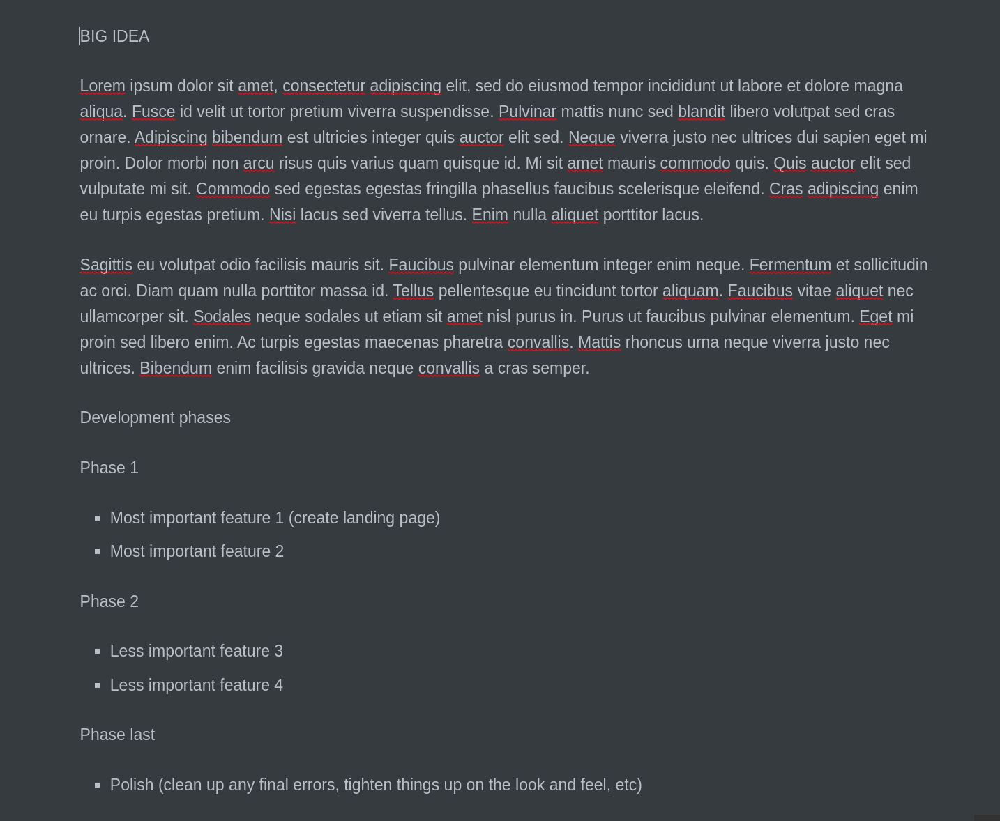

Now we are ready to go to GitHub and select "Issues" on our repository page.

- GitHub Issues and Milestones

(screenshot here)

under "Add a title" we just copy paste the bullet point text (or a shortend variation of it).

(screenshot here)

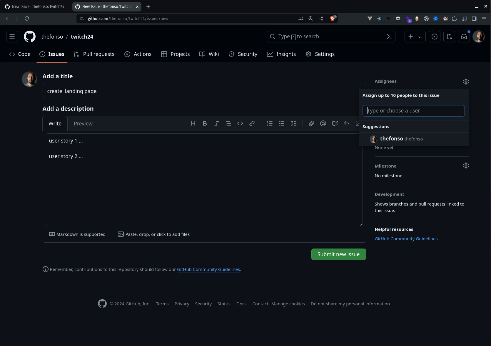

next under description we copy paste our detailed User Story description.

Now this part will require you to be flexible as you will be converting your client interview content and phase lists with detailed user stories associated with that list. Adjusting as you go inside each "Issues" item. Basically, you want for each bullet point that lives inside a phase, you want one or more associated User stories. Try to get them close to a 1-to-1 as best you can but if you need to add more, do so.

(screenshot of Big idea text / Phases bullet points / User stories / Issues)

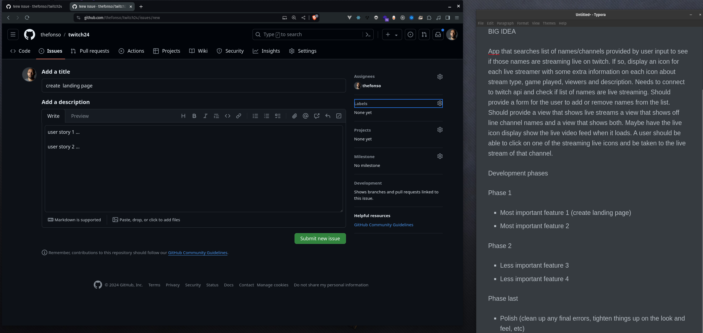

Next, associate different "issues" with different "Milestones"

(screenshot)

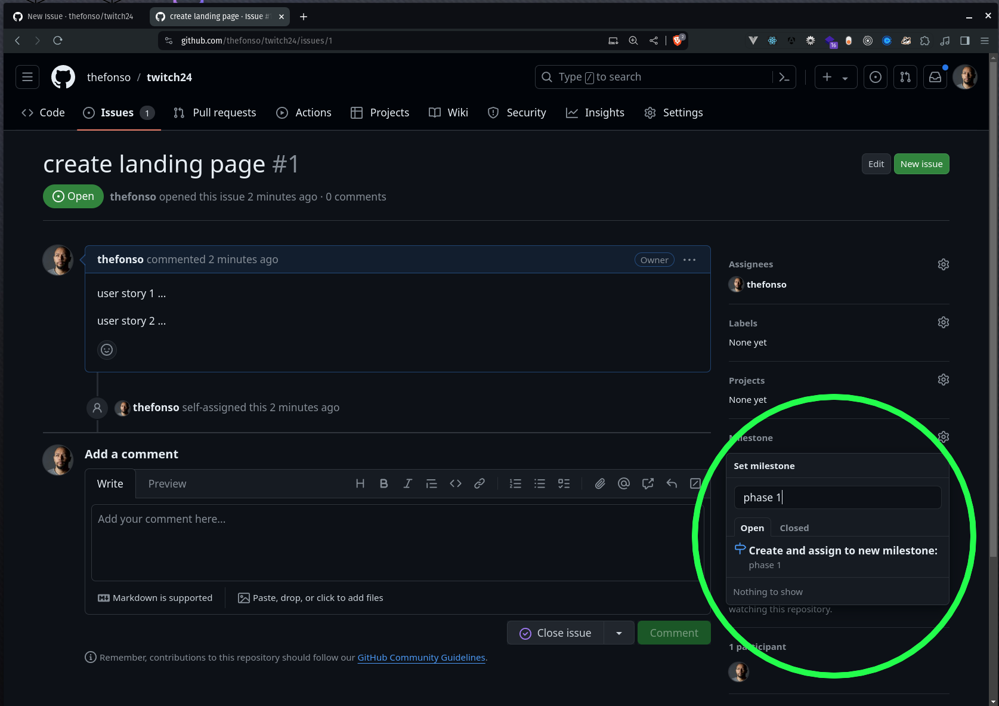

Milestone due dates

After creating a milestone via an issue's page, navigate to the Milestones landing page. To do this, navigate to the main "issues" page by clicking on "issues" on the navbar.

(screenshot)

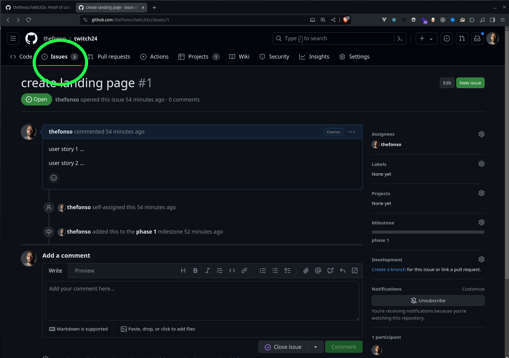

Then select the Milestones link...

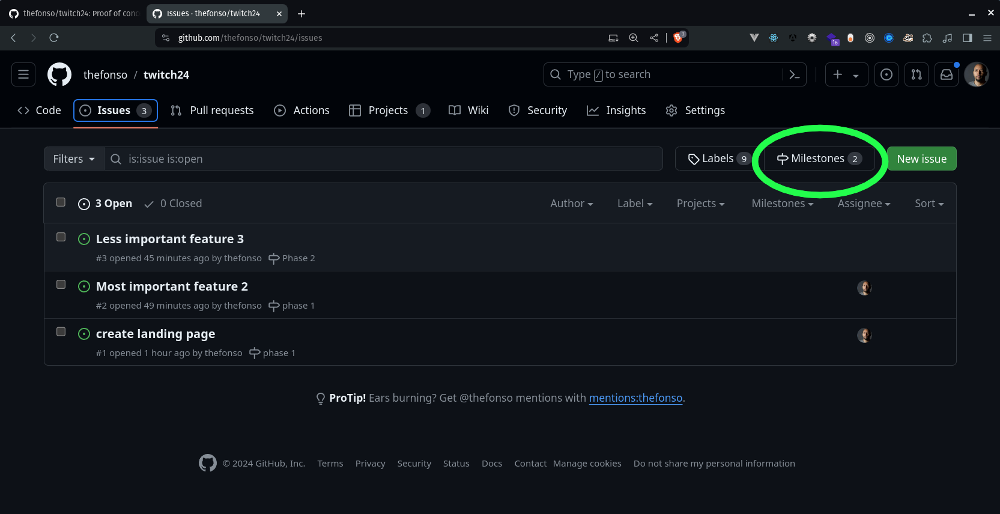

...select "edit" and assign a due date for each of your phases.

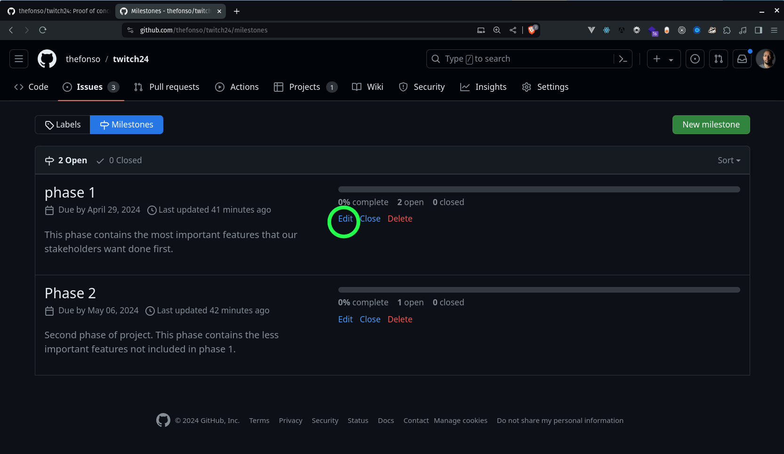

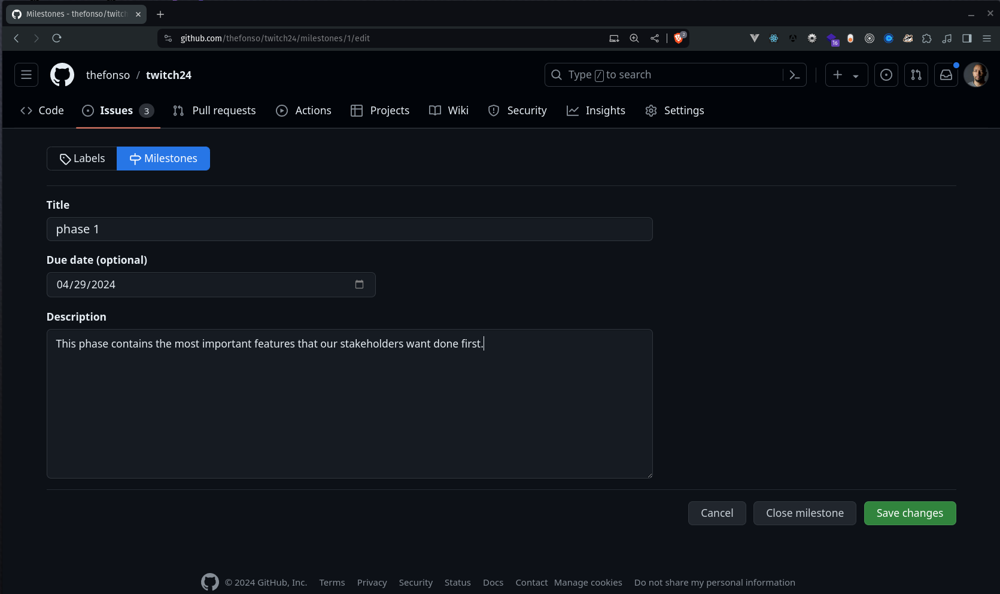

Now you have a time-line. You can assign phases along any number of days, weeks, etc you see fit.

### Projects

Bonus: GitHub has a relatively new feature called “Projects” that functions just like Trello. Under their template “Team planning” you get To do, In Progress, and Done, list.

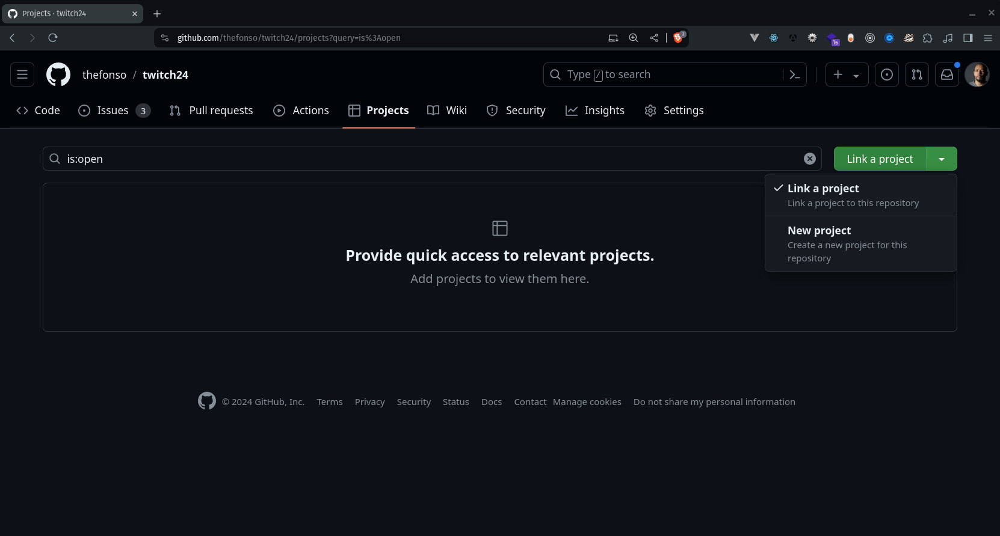

From the templates list, we'll select "Team Planning"...

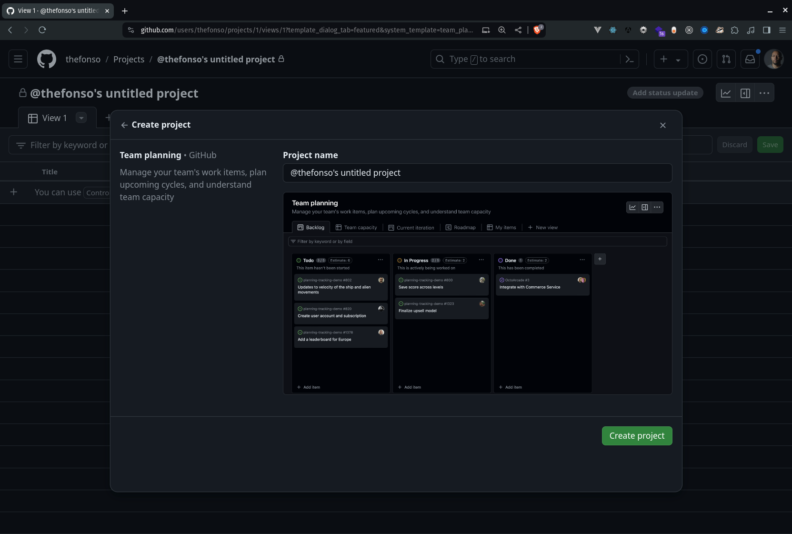

You can associate your GitHub repo and then add your “issues” and they will become cards on the project list.

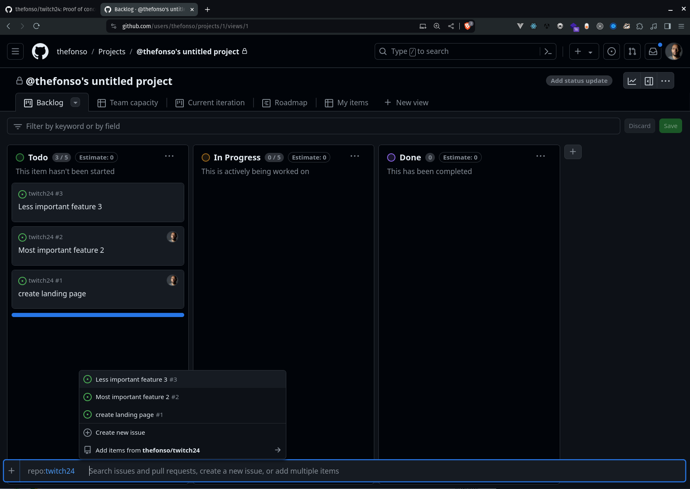

You can drag a card over to the next list i.e. "In Progress" ...

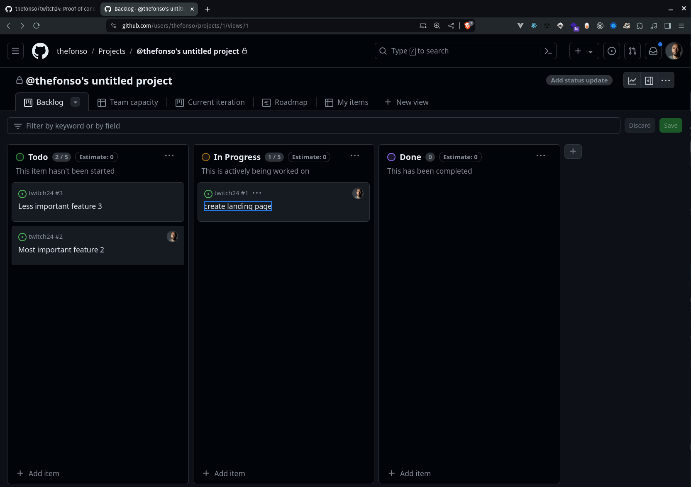

and click on it to get info...

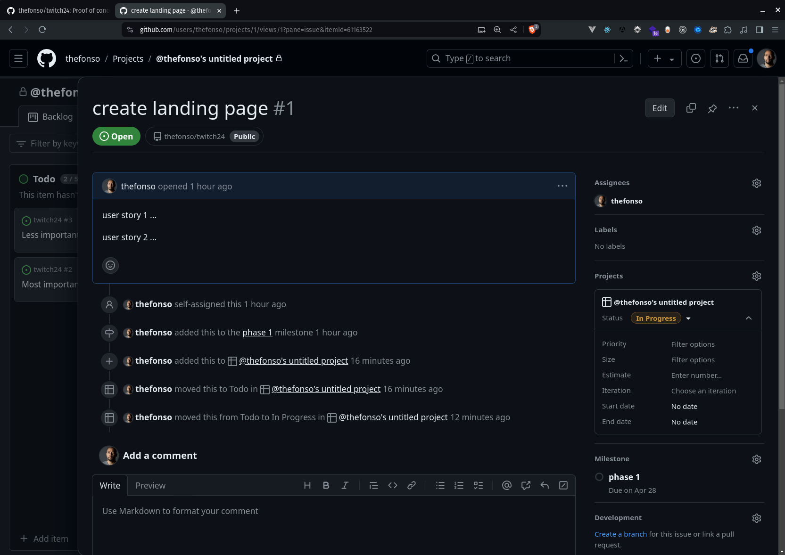

Note the milestone association.

### Collaborators

Navigate to Settings / Collaborators and add your team mates github names

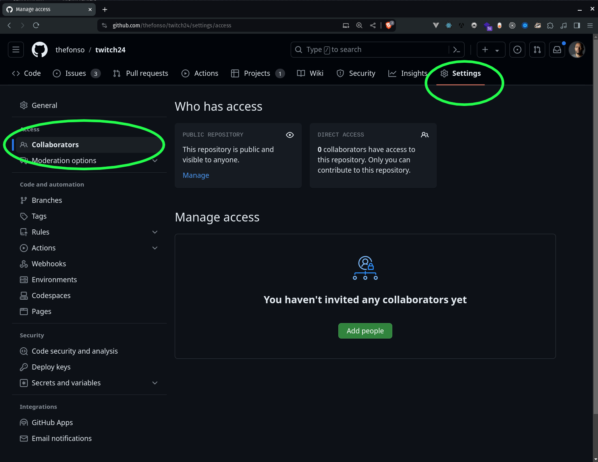

### Time estimation

Let's talk about time estimation and the "X" factor. I'm mah tell you somethin'. You never ever ever work on your baseline timeline. You always adjust for the "X" factor. So what am I talking about? "X" is based on multiple factors...

- Someone on your team fell ill
- An important aspect of your code base, say an important package or third party tool, broke down due to "reasons". Which results in you using time to find a replacement.
- The new operating system update broke your teams development environment.
- Something, always, happens.

...So you plan for it. If you think issue 01 will take 1 day to complete add another half day or full day on top of that. If you think changing the CSS on the form will take a few hours, add another workday. Once you have that "X" factor time included, NOW you have a more realistic time frame. This is the turn around time you report back to your client.

So what happens if nothing "falls from the sky" then you get to turn in your project ahead of schedule and your client is happy.
If something does "fall from the sky" you will be in a better position to deliver on time.

### Daily Stand Up

So one very critical thing we do at the beginning of everyday is a
thing called daily stand up. This is where we come together in a
circle and each team member talks about...

- What you worked on yesturday
- What you are working on today
- Any blocks of any kind

...why is this important? It helps to keep the entire team aware of what's going on everywhere in the team. Teams that hide problems from team members, fail. Teams that share problems with team members win. Open communications allows you to move past obstacle's fast. Blocks can be anything from having a hard time with a specific issue or user story to the battery in your mouse not working.

Extra resource on Daily Stand-up and other Agile practices:
https://www.aha.io/roadmapping/guide/agile/what-is-a-daily-standup

### Trello

Navigate to trello.com and create a free account.

(screenshot)

Select "Basic Project Board" template

- Brainstorm
- To Do
- Doing
- Done

  Now take a peek at the Trello teams's 5 min Demo to get a feel on how cards work...

resources:
https://www.youtube.com/watch?v=xky48zyL9iA

GitHub team work - pull request

